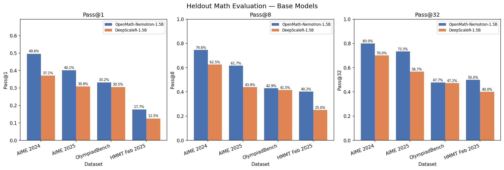

# Heldout Math Evaluation Report

**Date**: 2026-04-13
**Cluster**: Rorqual (Alliance Canada), H100 80GB nodes
**Account**: def-ashique

---

## 1. Configuration

| Parameter | Value |
|-----------|-------|
| n_samples | 32 |
| temperature | 0.7 |
| top_p | 0.95 |
| max_concurrent_rollouts | 8 |
| mem_fraction_static | 0.9 |
| context_length | 32768 |
| max_new_tokens | 12000 |
| GPUs per job | 1x H100 80GB |
| Reward function | `gsm8k_reward_fn` (exact match) |

### Models

| Model | Local Path | Parameters |
|-------|------------|------------|
| OpenMath-Nemotron-1.5B | `/home/fengdic/scratch/models/OpenMath-Nemotron-1.5B` | 1.5B |
| DeepScaleR-1.5B-Preview | `/home/fengdic/scratch/models/DeepScaleR-1.5B-Preview` | 1.5B |

### Datasets

| Dataset | Problems | Source |
|---------|----------|--------|
| AIME 2024 | 30 | `math-ai/aime24` |
| AIME 2025 | 30 | `math-ai/aime25` |
| OlympiadBench | 1517 | `lmms-lab/OlympiadBench` |
| HMMT Feb 2025 | 30 | `math-ai/hmmt_feb_2025` |

---

## 2. Results

All 8 model-dataset combinations completed with **full data**: every problem has exactly
32 samples written to JSONL.

### Pass@1

| Dataset | Nemotron-1.5B | DeepScaleR-1.5B | Delta |
|---------|:-------------:|:---------------:|:-----:|
| AIME 2024 (30) | **0.496** | 0.371 | +33.7% |
| AIME 2025 (30) | **0.401** | 0.308 | +30.2% |
| OlympiadBench (1517) | **0.332** | 0.305 | +8.8% |
| HMMT Feb 2025 (30) | **0.177** | 0.125 | +41.7% |

### Pass@8

| Dataset | Nemotron-1.5B | DeepScaleR-1.5B | Delta |
|---------|:-------------:|:---------------:|:-----:|
| AIME 2024 (30) | **0.746** | 0.625 | +19.4% |
| AIME 2025 (30) | **0.617** | 0.439 | +40.5% |
| OlympiadBench (1517) | **0.429** | 0.415 | +3.5% |
| HMMT Feb 2025 (30) | **0.402** | 0.250 | +60.8% |

### Pass@32

| Dataset | Nemotron-1.5B | DeepScaleR-1.5B | Delta |
|---------|:-------------:|:---------------:|:-----:|
| AIME 2024 (30) | **0.800** | 0.700 | +14.3% |
| AIME 2025 (30) | **0.733** | 0.567 | +29.3% |
| OlympiadBench (1517) | **0.477** | 0.472 | +1.1% |
| HMMT Feb 2025 (30) | **0.500** | 0.400 | +25.0% |

### Visualization



---

## 3. Analysis

### Key Findings

1. **Nemotron-1.5B consistently outperforms DeepScaleR-1.5B** across all benchmarks and
   all pass@k values. The gap is largest on HMMT Feb 2025 (+41.7% at pass@1) and
   smallest on OlympiadBench (+8.8% at pass@1).

2. **HMMT Feb 2025 is the hardest benchmark** for both models. Nemotron achieves only
   17.7% pass@1 and DeepScaleR only 12.5%. Even at pass@32, Nemotron only reaches 50%.

3. **AIME 2024 is the easiest benchmark**, with Nemotron at 49.6% pass@1 and reaching
   80% at pass@32. This suggests both models have strong coverage of AIME-style
   competition problems from 2024.

4. **OlympiadBench shows the smallest gap** between models at every k value (~1-9%).
   With 1517 problems spanning multiple domains, this is the most statistically robust
   comparison.

5. **Pass@k scaling**: Both models show healthy scaling from pass@1 to pass@32,
   indicating diverse generation — not mode collapse. Nemotron's pass@32/pass@1 ratio
   ranges from 1.4x (OlympiadBench) to 2.8x (HMMT), showing it benefits strongly from
   repeated sampling on harder problems.

### Implications for Hint RL

These base model results establish the **pre-training baselines** for the Hint RL
experiments. Both Nemotron and DeepScaleR will be fine-tuned with different RL strategies
(Hint RL, QuestA, DAPO, OPSD). The gap between base models suggests Nemotron is the
stronger starting point, but the RL training may close or widen this gap depending on the
method.

---

## 4. Data Integrity

| Trial | Files | Samples | Lines/File | OOMs | ConnFail | Verdict |
|-------|:-----:|:-------:|:----------:|:----:|:--------:|---------|
| aime24-nemotron | 30/30 | 960 | 32 | 3 | 56 | RELIABLE |
| aime25-nemotron | 30/30 | 960 | 32 | 1 | 50 | RELIABLE |
| olympiad_bench-nemotron | 1517/1517 | 48544 | 32 | 1 | 3022 | RELIABLE |
| hmmt-nemotron | 30/30 | 960 | 32 | 1 | 56 | RELIABLE |
| aime24-deepscaler | 30/30 | 960 | 32 | 2 | 52 | RELIABLE |
| aime25-deepscaler | 30/30 | 960 | 32 | 1 | 50 | RELIABLE |
| olympiad_bench-deepscaler | 1517/1517 | 48544 | 32 | 1 | 3022 | RELIABLE |
| hmmt-deepscaler | 30/30 | 960 | 32 | 2 | 54 | RELIABLE |

**Why OOMs don't affect data integrity**: SGLang OOMs cause request failures that return
`traj=None`. The `_dump_trajectory` function only writes to JSONL after a fully
successful generation + reward computation. Every file has exactly 32 lines with
non-empty completions (min 1,760 chars). The OOMs caused SGLang to retract and retry
requests, slowing jobs but not corrupting data.

---

## 5. Job History

### Final Successful Batch (MAX_CONCURRENT=8)

| Job ID | Model | Dataset | Status | Runtime | Node |
|--------|-------|---------|--------|---------|------|
| 10302141 | Nemotron | AIME 2024 | COMPLETED | 18m | rg31607 |
| 10342927 | Nemotron | AIME 2025 | COMPLETED | 13m | rg32001 |
| 10302143 | Nemotron | OlympiadBench | COMPLETED | 7h13m | rg21801 |
| 10302144 | Nemotron | HMMT Feb 2025 | COMPLETED | 14m | rg21802 |
| 10342928 | DeepScaleR | AIME 2024 | COMPLETED | 11m | rg21801 |
| 10302146 | DeepScaleR | AIME 2025 | COMPLETED | 10m | rg21806 |
| 10302147 | DeepScaleR | OlympiadBench | COMPLETED | 4h58m | rg21802 |
| 10342929 | DeepScaleR | HMMT Feb 2025 | COMPLETED | 11m | rg21804 |

### Failed Jobs (scheduling collisions, resubmitted)

| Job ID | Cause | Resolution |
|--------|-------|------------|
| 10302142 | Port 36355 collision on rg31607 | Resubmitted as 10342927 |
| 10302145 | 3 jobs on rg21802, GPU contention | Resubmitted as 10342928 |
| 10302149 | 3 other processes on GPU (OOM at init) | Resubmitted as 10342929 |

---

## 6. Log Locations

### In Repo (`logs/`)

```
logs/
  {JOBID}-eval_heldout.{out,err}              # SLURM stdout/stderr
  eval_{dataset}/eval_{dataset}-{model_tag}/
    config.yaml                                # Experiment config
    eval-rollout.log                           # SGLang worker log
    merged.log                                 # Merged output
    rollout/0/{0..N}.jsonl                     # Full results (32 samples each)
```

### On Scratch (Original)

```
/scratch/fengdic/logs/hint_rl/{JOBID}-eval_heldout.{out,err}
/scratch/fengdic/hint_rl_results/logs/fengdic/eval_{dataset}/{trial_name}/
```

---

## 7. Infrastructure Issues Resolved

| Issue | Root Cause | Fix |
|-------|-----------|-----|
| No internet on compute nodes | Alliance Canada policy | Pre-download models + `HF_HUB_OFFLINE=1` |
| Tokenizer load failure | HF repo IDs in offline mode | Local absolute paths in `.dat` file |
| GLIBC_ABI_DT_RELR crash | AReaL's `stdbuf -oL` injecting CVMFS libstdbuf.so | Patched SGLang `get_nvgpu_memory_capacity()` torch fallback |
| cc1plus not found (JIT fail) | `PATH=/usr/bin:$PATH` overriding CVMFS gcc | Removed PATH override |
| Python module mismatch | `module load python/3.10.13` vs venv's 3.12.4 | Removed `module load python` |
| SGLang OOM (MAX_CONCURRENT=48) | 1536 concurrent requests overwhelm KV cache | Reduced to MAX_CONCURRENT=8 |
| Stale .pyc bytecode | Python caching pre-patch SGLang code | Deleted `.pyc` file |
| Job scheduling collisions | Multiple jobs on same node | Resubmit failed jobs |

---

## 8. Reproduction

```bash
# Submit all 8 jobs (default: n_samples=32, max_concurrent=8, 12h limit)
bash cc_scripts/slurm/resubmit_heldout_eval.sh

# Interactive single eval
salloc --account=def-ashique --time=1:00:00 --mem=64G --cpus-per-task=8 --gres=gpu:h100:1
N_SAMPLES=32 MAX_CONCURRENT=8 bash cc_scripts/slurm/salloc_eval.sh aime24

# Generate plot from results
source .venv/bin/activate
python cc_scripts/plots/plot_heldout_bar.py \
    --results-root /scratch/fengdic/hint_rl_results/logs/fengdic \
    --k-values 1 8 32 \
    --output cc_scripts/plots/figures/heldout_eval_bar.png
```
